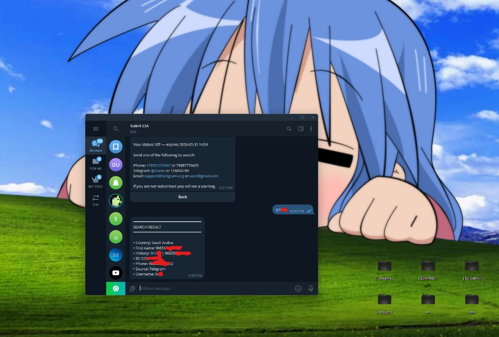

**PROJECT_NAME:** OSINT LIKE CIA  
**IDENTIFIER:** @cia1337bot  

---

### // START_ENCRYPTED_SESSION

 

#  GO TO BOT CIA [[Click ME ](https://t.me/cia1337bot)]

 

---

### // PREVIEW the BOT

 

---

### // OPERATIONAL_MANUAL

[SECTION_01: SIGNAL_RECON]
- Cross-referencing mobile identifiers.
- Global database indexing.

[SECTION_02: ENTITY_EXTRACT]
- Telegram UID metadata retrieval.
- Deep-level history tracking.

[SECTION_03: FOOTPRINT_TRACE]
- Email association protocols.
- Digital signature mapping.

 

---

**[About]**
- for Stone Group

# 43B DB

---

**[STATUS]**
- ACTIVE
